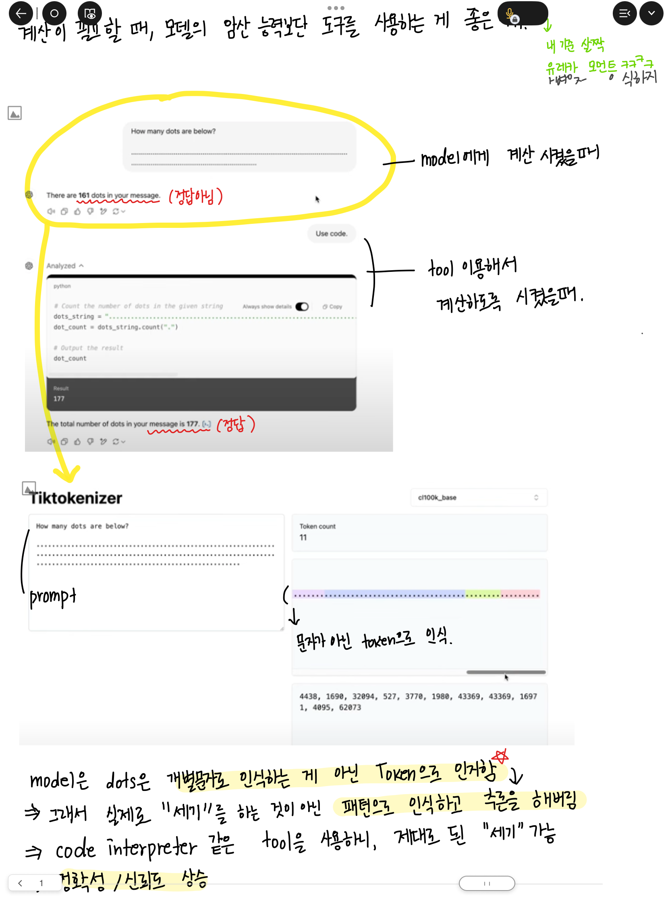

> [ChatGPT의 작동 원리 이해하기](https://youtu.be/6PTCwRRUHjE?si=RNLS1Oc2ro7rfcqv) 영상을 시청하며 학습한 내용을 아이패드로 필기해 정리했습니다.
> - ChatGPT를 비롯한 대형 언어 모델(LLM)의 내부 작동 방식 이해
> - Transformer 구조 및 작동 흐름에 대한 개념 정리

## 1. Pre-Training

## 2. Post-Training

## 3. SFT Model (Supervised Fine Tuning)
사실상 얘도 post-training의 일환이긴 함.

