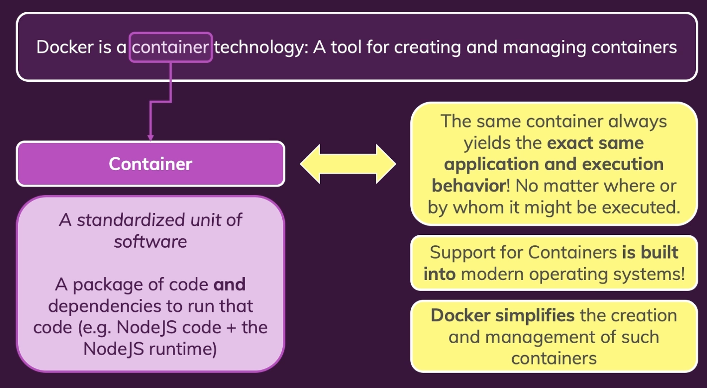
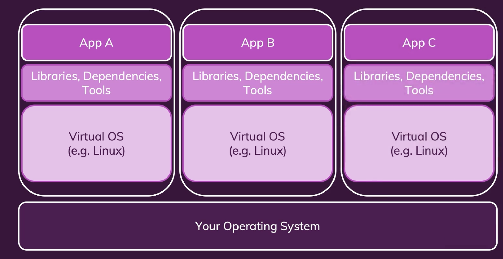
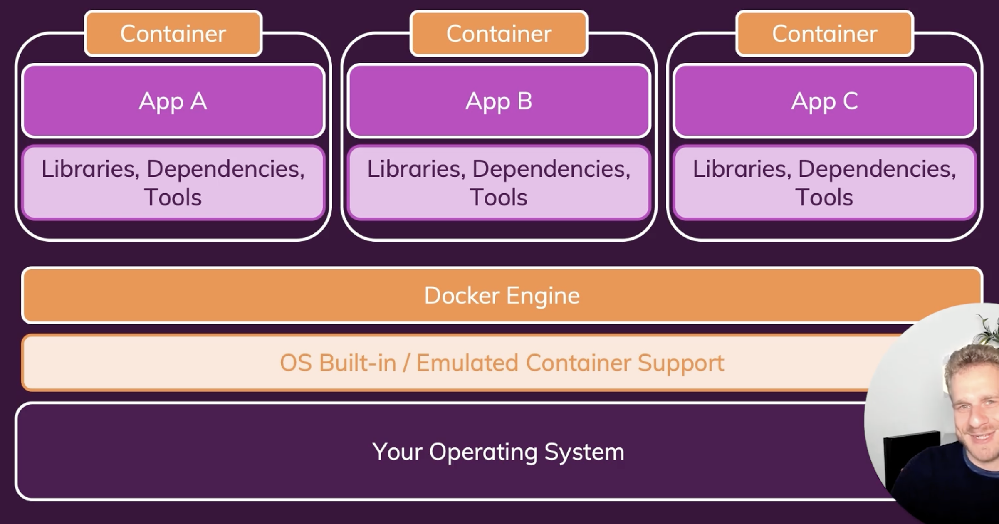

# 도커란?



컨테이너를 생성하고, 관리하는 도구이다.

### 컨테이너란?

표준화된 소프트웨어 유닛 → **코드실행을 위한 종속성과 도구 ( 코드패키지)**

즉, 동일한 코드와  동일한 도구를 사용하는 동일한 컨테이너는 **항상 동일한 동작과 결과를 제공**한다.

다양한 코드와 도구를 넣을 수 있지만 한편으론 그 **컨테이너 그 자체로 독립적으로 ( standalone ) 하게 작동**한다는 이점 또한 있다.

가상머신과 달리 운영체제의 커널을 공유하기 때문에 훨씬 가볍고 빠르다. ( **컨테이너 지원은 최신 운영 체제에 내장** ) 

### 컨테이너 지원이란?

<aside>
📌

운영 체제에 "컨테이너 지원이 내장되어 있다"는 말은 최신 OS들이 컨테이너 기술을 구동하기 위한 핵심 기능(네임스페이스, cgroups 등)을 이미 포함하고 있음을 의미

</aside>

컨테이너가 동작하려면 운영체제가 몇 가지 기능들을 지원해야 한다.

1. **Namespace**
    - 각 컨테이너가 고유한 파일 시스템, 네트워크 스택, 프로세스 ID 등을 가지도록 분리
    - 리눅스에서는 `pid`, `net`, `mnt`, `ipc`, `uts` 등의 네임스페이스가 사용됨
2. **Cgroups (Control Groups)**
    - CPU, 메모리, 디스크 I/O 등 리소스를 제한하거나 관리
3. **UnionFS**
    - 여러 계층(layer)으로 이루어진 파일 시스템을 사용해 컨테이너 이미지를 효율적으로 관리

# 왜 컨테이너인가?

> 왜 우리는 소프트웨어 개발에서 **독립적**인 **표준화**된 애플리케이션 패키지를 원하는 걸까?
> 
1. 서로 다른 개발환경에서 발생할 수 있는 잠재적 문제를 방지할 수 있다. 
2. 소프트 웨어 개발에서는 안전하고 동일한 재현성을 보장해준다.
3. 혼자 작업하는 경우에도, 작업중인 프로젝트가 여러 개일 경우 버전이 충돌할 수 있는 문제를 방지한다.

# 가상머신 vs Docker 컨테이너

### 가상머신



가상머신 

[ 장점 ] 

가상의 **운영체제까지 갖추어진** **독립적인 환경**을 만들고 있다.

말하자면, **컴퓨터 안에 다른 독립적인 컴퓨터**가 있다고 생각하면 된다.

그렇기 때문에, 도커 컨테이너와 마찬가지로 동**일한 실행결과( 재현성 )를 보장**받을 수 있다.

[ 단점 ]  

운영체제를 지닌 여러 가상머신에서 발생하는 오버헤드 → 많으면 많을 수록 문제 🔺

- **매번 새로운 컴퓨터를 머신 내부에 설치**해야한다.
- 메모리, CPU, 하드 드라이브 **공간을 낭비**하게 된다.
    - 머신 내 운영체제가 리눅스라 할지라도 모든 머신마다 운영체제를 설치해야 하고 그것이 곧 많은 공간을 차지하게 된다.
- **공유할 수 있는 단일 구성파일이 없다.**
    
    운영체제, 설치된 패키지, 네트워크 구성 등 모든 환경을 개별적으로 준비하고 설정하는 작업들은 주로 수동 아니면 복잡한 스크립트를 통해 이루어지며 이를 표준화 할 수 있는 단일 파일이 없다는 뜻.
    
    - 개발에서 제품 생산을 위해 애플리케이션을 배포하려면, 가상머신과 동일한 방식으로 프로덕션 머신을 구성해야 한다는 큰 단점이 있다.
    - 프로덕션 머신에서 버츄얼머신을 실행해도 성능이 낭비된다.

### 도커 컨테이너


도커 컨테이너

- **운영체제가 기본적으로 내제되어 있다.**
- os와 엔진을 제외한 소스코드와 패키지 및 도구, 런타임만 컨테이너에 포함하기 때문에 가볍고 **오버헤드가 적다**.
- **단일 구성파일이 있어서 다른사람들과 공유할 수 있다. ( 이미지 )**
    - 컨테이너를 이미지에 빌드할 수 있다.
    - 그 이미지를 다른 사람과 공유해서 모두가 나의 시스템에 잇는 동일한 컨테이너를 시작할 수 있다 .
- **최소한의 디스크 공간**을 사용하지만, **앱에 필요한 모든 것들을 캡슐화** 하고 있다.

# Docker Tools 개요



### Docker Engine

- 도커의 핵심 런타임. 컨테이너를 빌드하고 실행하는 데 필요하다/
- 구성요소
    - Docker Daemon : 컨테이너를 생성하고 관리하는 서버 프로세스
    - CLI ( Command Line Interface ) : 사용자가 Docker 명령어로를 입력해 Daemon과 상호작용
    - API : Docker Daemon과 통신하는 Restful 인터페이스
- Docker CLI를 통해 명령을 보내면 Docker Daemon이 컨테이너를 생성하거나 이미지를 다운로드한다.

### Docker Desktop

- 로컬에서 도커를 쉽게 실행하고 관리할 수 있도록 하는 GUI 도구
- 특징
    - Docker CLI와 Docker Engine을 포함하여 설치와 관리가 간단하다
    - Kubernetes 클러스터 실행 옵션도 제공한다.

### Docker Hub

- Docker 이미지 클라우드 저장소 ( github 도커 버전이라고 생각하면 된다. )

### Docker Compose

- 여러 컨테이너로 구성된 애플리케이션을 쉽게 정의하고 실행할 수 있도록 지원한다.
- 사용방식 :
    - yaml 파일에 컨테이너 설정을 정의한다.
    - 단일 명령 ( docker-compose up ) 으로 모든 컨테이너를 실행한다.
- 장점
    - 복잡한 애플리케이션 스택을 손쉽게 설정하고 배포할 수 있다.
    - 여러 컨테이너의 네트워킹 및 볼륨 공유를 자동으로 처리해준다.
- 예시 yaml
    
    ```python
    version: "3.9"
    services:
      web:
        image: nginx
        ports:
          - "80:80"
      db:
        image: mysql
        environment:
          MYSQL_ROOT_PASSWORD: example
    ```
    

# 실전

### 1. 도커 파일

```python
# 예시 Dockerfile
FROM node:20

WORKDIR /app
COPY package.json .
RUN npm install
COPY . .

CMD ["node", "app.js"]

```

### 2. 도커 이미지 빌드

```python
docker build -t docker-k8 .
```

### 3. 빌드한 이미지 실행

-p : 실행하려는 컨테이너에 포트를 Publish 하기위해 필요한 옵션 **`-p <로컬 포트>:<컨테이너 포트>`**

- 컨테이너 내에 실행중인 애플리케이션에 HTTP 요청을 보내려면, 통신하려는 컨테이너의 포트를 열어야 한다. 그렇지 않으면 컨테이너는 잠긴 네트워크이기 때문에 외부와 통신을 할 수가 없게 된다.

```python
docker images # 빌드된 이미지 확인 명령어 -> image ID값
# http://localhost:3000 접속 가능해짐
docker run --name {컨테이너 이름} -p 3000:3000 {image id} 
```

- 컨테이너 재사용 방법
    
    ```python
    docker ps
    docker start {컨테이너 ID}
    ```
    
- 안쓰는 컨테이너 정리
    
    ```python
    docker ps -a #실행되지 않고 있는 컨테이너까지 리스트업
    docker rm {컨테이너 ID}
    ```
    

### 4. 실행되고 있는 도커 확인 / 실행중지

```python
docker ps
docker stop gallant_haslett(도커이미지 이름임)
docker stop {컨테이너 ID}
```