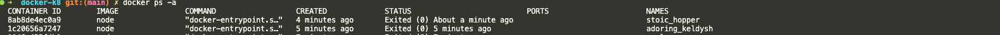
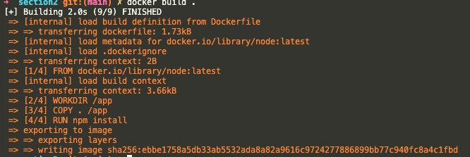

# 이미지

모든 설정 명령과 모든 코드가 포함된 **공유가능한** 패키지.

컨테이너는 그러한 이미지의 구체적인 실행 인스턴스라고 보면 된다.

즉, `이미지를 기반으로 하는 컨테이너를 실행`하는 것이다.

## 이미지 사용과 실행

### 외부 이미지의 사용과 실행

- Docker hub 접속
- node js 공식 이미지로 컨테이너 실행
    
    ```python
    docker run node
    ```
    
- 도커 컨테이너를 실행시켰다 하더라도 내부 터미널에 접근할 수 없다.
    
    따라서, 아래의 명령어를 통해 **컨테이너 내부 터미널 세션을 열어 명령어를 입출력**할 수 있다. 
    
    즉, 도커에게 컨테이너 내부에서 호스팅머신으로 대화형 세션을 노출하고 싶다고 알리는 것이다.
    
    ```python
    docekr run -it code
    ```
    
- 다시 dodcker ps -a를 치면
    
    동일한 이미지를 기반으로 하는 컨테이너가 1개 더 생성되어 있는 걸 확인할 수 있다.
    

    

### 자체적으로 생성한 이미지의 사용과 실행

- 공식 이미지를 다운로드 한다. ( 예 : Node JS )
- 그 위에 코드를 추가한 새로운 이미지로 코드를 실행한다.

## Docker file을 사용하여 자체적인 이미지 빌드하기

- 실행할 프로젝트의 root 위치에 Dockerfile을 생성한다.
- 해당 파일에 이미지를 빌드할 때 실행하려는 도커에 대한 명령을 작성한다.
    
    ```docker
    FROM node 
    
    WORKDIR /app
    
    COPY . /app
    
    RUN npm install
    
    EXPOSE 80
    
    CMD ["node", "server.js"]
    ```
    
    ---
    
    - **`FROM node`**
        - 도커 허브에 있는 노드 이미지를 가져온다.
    - **`WORKDIR /app`**
        - 도커 컨테이너 내부에서 애플리케이션을 실행하는 작업 디렉토리를 선언한 것이다.
        - 실제로 도커에터 루트폴더를 그대로 사용하기 보단 서브폴더를 사용하는 것을 권장한다.
    - **`COPY . /app`**
        - 첫 번째 경로는 컨테이너의 외부 즉, 이미지로 복사되어야 할 파일들이 있는 곳을 의미한다.
            - 이 프로젝트의 모든 폴더, 하위 폴더 및 파일을 모두 복사해야 한다고 알려주는 것이다.
        - 두 번째 경로는 도커 내부파일 시스템인데, 여기에 파일들이 모두 복사된다.
    - **`RUN npm install`**
        - 이 작업은 디폴트로 도커 컨테이너 및 이미지의 작업 디렉토리에서 실행된다.
    - **`EXPOSE 80`**
        - 언제나 컨테이너가 실행될 때, 로컬 시스템에 특정 포트를 노출하고 싶다는 것을 도커에게 알리는 EXPOSE 명령을 반드시 추가해야한다.
    - **`CMD ["node", "server.js"]`**
        - 이미지를 기반으로 컨테이너를 시작하는 경우에만 서버를 시작하고 싶다면, RUN이 아닌 CMD명령어를 이용한다.
- 작성한 dockerfile을 토대로 새로운 이미지를 생성(빌드)한다.
    
    ```docker
    docker build .
    ```
    
  
    
    dockerfile에 작성한 명령어 그대로 실행되어 이미지가 빌드된 것을 확이할 수 있다.
    
- 해당 이미지 실행해보기 ( 컨테이너 이름 지정해서 )
    
    ```docker
    docker run --name node-project -p 3000:80 {imageID}
    ```
    
    - 중요한 플래그 **`-p {로컬포트}:{도커를 노출할 포트}`**

<aside>
📌

소스코드의 변경사항을 반영하기 위해선, 새로 이미지 빌드해야 한다.

</aside>

## ⭐️ 레이어기반 아키텍처 ⭐️

> Dockerfile의 명령어 한 줄 한줄이 레이어다.
> 

변경된 소스코드가 없을 경우, 따로 Copy할 파일이 없기 때문에 캐싱된 레이어로 재빌드를 진행하여 속도가 아주 빠르다. 반면에 변경사항이 있을 경우, 각 명령어 (레이어)들 중에 캐싱된 레어이가 선택적으로 작용하기 때문에 빌드 속도가 저하된다. ( **한 레이어가 변경될 때마다 후속 레이어들도 재실행이 된다.** )

그렇기 때문에, 현재 Dockerfile에서는 소스코드를 변경하고 재빌드할 때마다 pacakge.json에 있는 모든 패키지들이 다시 처음부터 install이 된다.

이런 불필요한 과정을 막기 위해 Dockerfile을 아래와 같이 변경하면, 빌드속도를 최적화할 수 있다!

**before**

```docker
FROM node 

WORKDIR /app

COPY . /app

RUN npm install

EXPOSE 80

CMD ["node", "server.js"]
```

**after**

```docker
FROM node 

WORKDIR /app

COPY package.json /app

COPY . /app

RUN npm install

EXPOSE 80

CMD ["node", "server.js"]
```