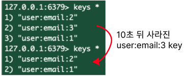

# 0. Redis의 자료구조
- 데이터를 String 형태의 value로 저장
- 가장 일반적인 key-value 구조의 형태

## redis는 0 ~ 15번 까지의 database로 구성되어 있다.
> select db 번호

## 데이터 베이스 내 모든 키 조회
> keys *

 

# 1. Strings
## 1.1 주요 스크립트

### set 을 통해 key:value 세팅
> set user:email:1 hong1@naver.com

### nx : 이미 존재하면 pass, 없으면 set
> set user:email:1 hong1@naver.com nx

### ex(expiration) : 만료시간(초단위), ttl(time to line)
> set user:email:1 hong1@naver.com ex 10
 

### key값으로 value 가져오기
> get user:email:1 
> hong1@naver.com

### 특정 key 삭제
> del user:email:1
### 현재 DB에 있는 모든 key 삭제
> flushdb

## 1.2 redis 활용 

### 사용자 인증정보 저장(refresh토큰)
> set user:1:refresh_token <난수> ex 100000

### 좋아요 기능 구현
- RDBMS에서는 동시성 문제로 인해 SELECT 후 +1 방식의 좋아요 증가 로직이 꼬일 수 있어 별도 제어가 필요함.
- 반면 Redis는 싱글 스레드 기반이라 별도 락 없이도 안전하게 +1 연산을 처리할 수 있음.
> set likes:posting:1 0  
> incr likes:posting:1  
> decr likes:posting:1

### 재고관리 
- 마찬가지로 RDBMS로 구현된 재고관리기능은 동시에 주문을 했을 때, 이슈가 발생할 수 있음.

### 캐싱
- 인기 게시글 
> set posting:1 "{\"title\"  : \"hello, python\", \"contents\" : \"python is ...\", \"author\" : \"kim1@naver.com\"}" ex 100

 

# 2. List (deque([부록 4](부록.md#부록-4-덱deque)) 자료구조)

> lpush : 데이터를 왼쪽에 삽입  
> rpush : 데이터를 오른쪽에 삽입  
> lpop : 데이터를 왼쪽에서 꺼내기  
> rpop : 데이터를 오른쪽에서 꺼내기

> lpush hongildongs hong1  
> lpush hongildongs hong2  
> rpush hongildongs hong3  
> lrange hongildongs 0 -1   

> rpop hongildongs  

### 리스트 조회 명령어
> lrange honglidongs 0 0 # 첫 번째 값만 조회  
> lrange honglidongs -1 -1 # 마지막 값만 조회  
> lrange honglidongs 0 -1 # 전체 조회  
> lrange honglidongs -2 -1 # 마지막 두 번째 부터 마지막까지  

### 데이터 개수 조회
> llen honglidongs
### ttl 적용
> expire honglidongs 20
### ttl 조회
> ttl honglidongs

### 2.3 redis 활용 : 최근 방문한 페이지, 최근 조회한 상품목록, 최근 검색어
- rpush를 이용해 순차적으로 데이터를 삽입
- lrange로 최근 몇 개의 데이터만 조회하는 방식으로 구현 가능
- 다만, 중복제거 기능이 없다는 점이 단점 ( 추후 zset 자료구조로 커버 가능 )

> rpush mypages www.naver.com  
> rpush mypages www.daum.net  
> rpush mypages www.openai.com  
> rpush mypages www.kozub.tistory.com  
> lrange mypages -3 -1 # 최근 방문한 페이지 3개  
