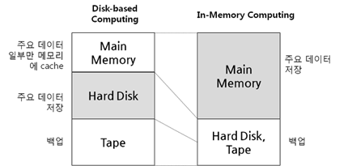

## 부록 1. 인메모리
인메모리(In-Memory)는 데이터를 디스크(HDD, SSD 등)에 저장하지 않고, 메모리(RAM)에 직접 올려서 처리하는 방식 또는 구조를 의미함.

#### 📌 특징
- **빠른 접근 속도**: 디스크 I/O를 생략하므로 매우 빠른 읽기/쓰기 성능을 제공함.
- **휘발성**: 메모리는 휘발성이라, 시스템 종료 시 데이터가 사라질 수 있음. 이를 보완하기 위해 주기적 백업(Snapshot)이나 디스크 기록(Log)을 병행함.
- **데이터 양 제한**: 메모리 크기에 따라 저장 가능한 데이터의 양이 제한됨. (비싸서 Disk 보다는 용량이 클 수가 없음.)

 

## 부록 2. 해시테이블
해시테이블은 특정 알고리즘을 이용해서 난수를 만들어, 이를 주솟값으로 쓰는 것을 의미함.

#### 📌 특징
- 키(key)를 해시 함수에 넣어 인덱스로 변환하여 값을 저장함. 따라서 fullscan을 할 필요없이 주소값으로 빠르게 조회가능.
    - 즉, 데이터를 찾을 때 해시 함수를 통해 바로 접근 가능하므로 평균 **O(1)** 시간복잡도
- 충돌이 발생할 수 있지만, Redis는 이를 잘 처리하도록 설계됨.
- 이런 특징 때문에, redis의 데이터 조회속도가 빠른 거임.

 

## 부록 3. Single Thread
**싱글스레드(Single-thread)**는 프로그램이 오직 **하나의 스레드**로만 작업을 처리하는 방식임. 즉, 한 번에 하나의 작업만 수행할 수 있으며, 동시에 여러 작업을 병렬로 실행하지 않음.

#### 📌 특징
- **동기적 처리**: 요청은 순차적으로 처리되며, 하나의 작업이 끝나야 다음 작업을 시작할 수 있음.
- **단순한 구조**: 동기 처리 특성상 락(lock)이나 동시성(concurrency) 문제를 크게 고려하지 않아도 됨.
- **처리량 한계**: 동시에 많은 요청이 들어오면 처리 대기열이 생기고 응답 지연이 발생할 수 있음.

#### [🔗 참고하기 좋은 글 - 싱글스레드와 멀티스레드](https://velog.io/@gil0127/%EC%8B%B1%EA%B8%80%EC%8A%A4%EB%A0%88%EB%93%9CSingle-thread-vs-%EB%A9%80%ED%8B%B0%EC%8A%A4%EB%A0%88%EB%93%9C-Multi-thread-t5gv4udj)